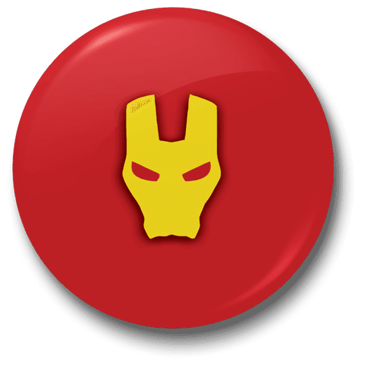
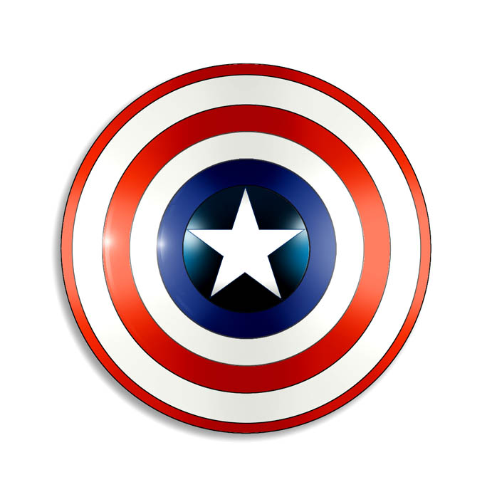
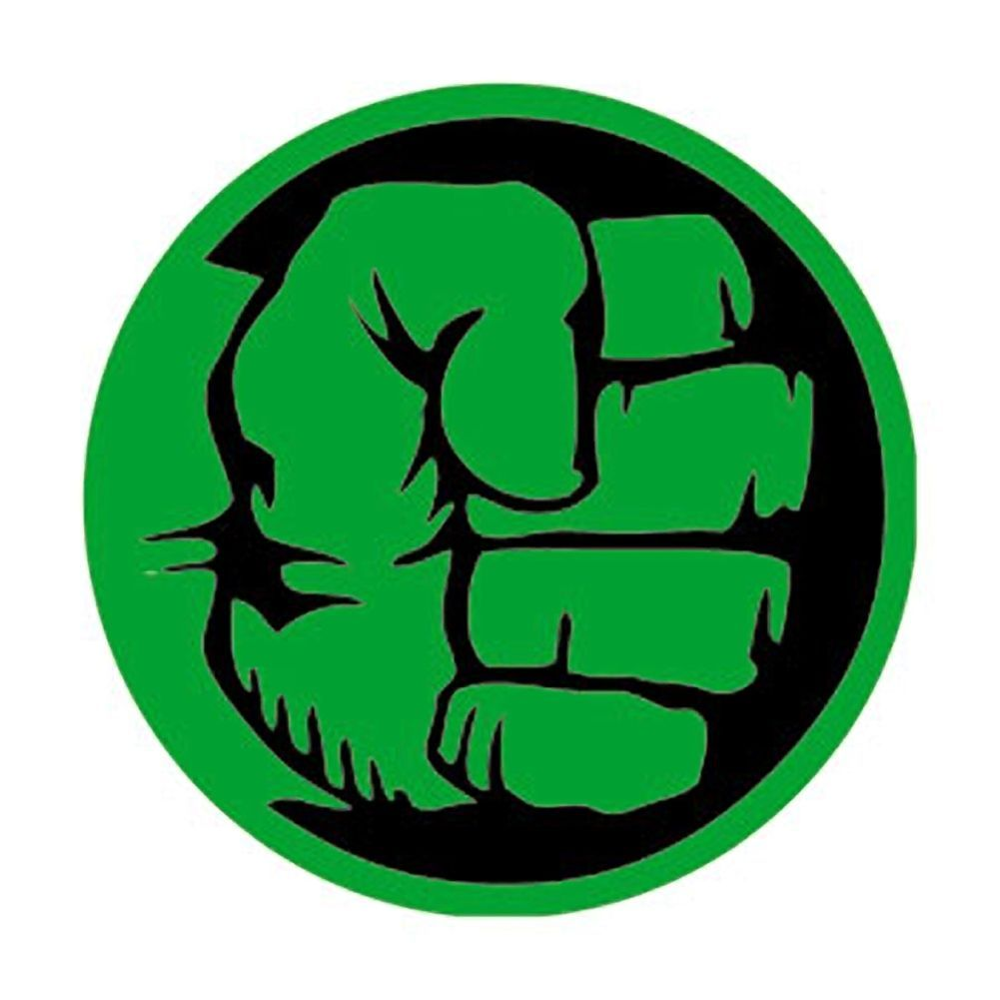

 
# TeamAvengers   

## POSTMAN Credentials: 
https://webavengers.postman.co/workspaces?type=personal

- Yelp: 
  - Client ID: 15QXWPrRyg8AiyWO61A1OA
  - API Key : pYscOdZ7ULnYDnuimywcKpeNZXvflwEkKSK4Kn1vfwziaxKxEW2K1sqnUI7QT0G3H9I1486KBYfxGCgTFqqmWICLAOw5eGRNdIz2ZNIyr-ayxufhzM9WxSNFtP75W3Yx
  - Documentation Yelp: https://www.yelp.com/developers/documentation/v3/event

- EventBrite: https://www.eventbrite.com/developer/v3/endpoints/events/
  - Client secret : BKYKNDM252SSRD6AJSROA3BXDV46YOVEOXFLELXLSNTBCGJLLN
  - Your personal OAuth token: T7R72VLGMJOJWGPBHTFE
  - Anonymous access OAuth token: 45YLXRLWWCXQIODF73Y
  - KEY: 2PTZHHBWN26C4DRKQN
  

# Few Guidelines: 
- Please update all credentials here and temporary ones on google doc here.
https://docs.google.com/document/d/15M8m1AvrRx5O5wSlJyXvS_c4wz9hz8QuDTFPJWC4E_A/edit
- Keep the api well documented from start. For any Backend and front-end api keep updating this space. 
- Please keep using Emojis and happy coding!
